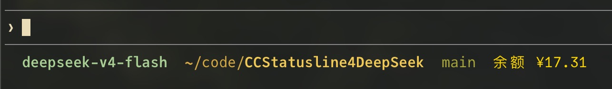
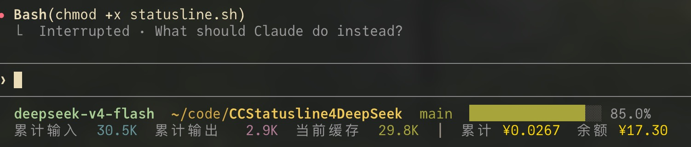

[English](README_en.md) | **中文**

# Claude Code Statusline – DeepSeek 版

专为 [Claude Code](https://claude.ai/code) 定制的双行状态栏，显示模型、工作目录、Git 分支、上下文窗口进度、Token 用量及**会话累计成本（¥）**。为 **DeepSeek 模型**优化——自动获取余额并使用正确的定价。




## 功能特性

- **双行布局** — 模型 + 目录 + 分支 + 进度条 + 精力等级（第一行），Token + 成本（第二行）
- **方块进度条** — 16 格，根据剩余百分比着色（绿/黄/红）
- **Token 计数器** — 累计输入、累计输出、当前缓存读取（格式化为 K/M）
- **成本追踪** — 基于会话的 JSON 累计器（`~/.claude/cache/statusline_cost.json`）。  
  每轮对话的增量 Token 按 DeepSeek 费率（Flash、Pro 或回退）计价，使用 API 返回的**累计值**计算，计费更准确。
- **回卷检测** — 自动识别 Claude Code 客户端侧压缩（上下文回卷），避免重复计费。
- **DeepSeek 余额** — 通过 `ANTHROPIC_AUTH_TOKEN` 请求 `https://api.deepseek.com/user/balance`，缓存 60 秒
- **精力等级** — 低/中/高，带彩色圆点
- **Git 根目录高亮** — 路径中的仓库根目录名以粗体显示
- **路径缩略** — `$HOME` 自动替换为 `~` 以缩短路径

## 安装

1. 将脚本保存为 `~/.claude/statusline.sh` 并赋予执行权限：
   ```bash
   chmod +x ~/.claude/statusline.sh
   ```
2. 在 `~/.claude/settings.json` 中添加以下配置：
   ```json
   {
     "statusLine": {
       "type": "command",
       "command": "bash ~/.claude/statusline.sh"
     }
   }
   ```
3. 脚本会自动读取当前 Claude Code 会话环境中的 `$ANTHROPIC_AUTH_TOKEN`，通常无需手动设置——它已经可用。（如果你的 DeepSeek API 密钥已在 Claude Code 中配置，余额获取开箱即用。）

## 使用

Claude Code 会自动运行脚本并显示状态栏，无需手动调用。

### 显示模式

根据当前会话状态，脚本会切换不同的显示布局：

| 状态 | 行数 | 内容 |
|------|------|------|
| 正常对话 | 双行 | line1: 模型 + 路径 + 分支 + 进度条 + 精力；line2: Token + 成本 + 余额 |
| 上下文回卷（客户端压缩） | 单行 | line1 + 余额（如有），隐藏 Token/成本行 |
| 新会话/无 Token 数据且无余额 | 单行 | line1，只显示模型、路径等基本信息 |
| 新会话/无 Token 数据但有余额 | 单行 | line1 + 余额 |

> 上下文回卷时显示单行是为了避免误报成本数据——回卷是客户端侧压缩，并非新对话，成本已在之前累计，不应重复展示。

### 色彩对照

| 颜色 | 用途 |
|------|------|
| 青色 (Cyan) | 模型名称 |
| 黄色 | 文件路径 |
| 绿色 | Git 分支名 / 进度条（>50%） |
| 紫色 (Magenta) | 输出 Token |
| 蓝色 | 输入 Token |
| 金色 (Gold) | 成本金额 / 余额 |
| 灰色 (Dim) | 次要信息（路径分隔符、分隔线）

## 定价（每百万 Token，单位 ¥）

| 模型   | 输入（缓存未命中） | 缓存读取（命中） | 输出   |
|--------|--------------------|------------------|--------|
| Flash  | ¥1.00              | ¥0.02            | ¥2.00  |
| Pro    | ¥3.00              | ¥0.025           | ¥6.00  |

回退使用 Flash 定价。定价最后更新：2026-06-07。

## 成本累计说明

脚本使用 DeepSeek API 返回的累计 Token 值来计算每轮对话的增量成本，而不是依赖当前快照。这意味着：

- **更准确的计费**：即使发生上下文回卷，成本也不会重复计算
- **回卷检测**：当检测到客户端侧压缩时，快照会自动更新，防止后续请求误判为新对话
- **缓存成本**：缓存读取和创建成本基于非负增量计算（最佳近似）

> **⚠️ 关于成本估算精度**：余额来自 DeepSeek API，精确可靠。累计成本基于 Token 用量 × 模型定价估算，由于**无法从 API 获取精确的缓存命中/未命中拆分**，缓存部分的成本分摊是近似值。实际费用请以 DeepSeek 对账单为准。

## 文件

### 缓存文件

- `~/.claude/cache/statusline_cost.json` — 按会话的累计成本
- `~/.claude/cache/statusline_balance.cache` — 余额缓存（60 秒）

### 输入数据格式

脚本从标准输入读取 Claude Code 发送的 JSON，核心字段如下：

```json
{
  "model": { "display_name": "DeepSeek V4 Flash", "id": "deepseek-v4-flash" },
  "session_name": "my-session",
  "session_id": "abc123",
  "workspace": { "current_dir": "/path/to/repo" },
  "context_window": {
    "remaining_percentage": 82.5,
    "current_usage": {
      "input_tokens": 15234,
      "output_tokens": 8901,
      "cache_read_input_tokens": 5000,
      "cache_creation_input_tokens": 2000
    },
    "total_input_tokens": 150000,
    "total_output_tokens": 75000
  },
  "effort": { "level": "medium" }
}
```

脚本使用 `total_input_tokens` / `total_output_tokens`（累计值）计算增量成本，而非当前快照值。

### 成本文件结构

`statusline_cost.json` 以会话 ID 为键，存储每个会话的累计数据：

```json
{
  "session_id_1": {
    "total_cost": 0.1234,
    "prev_in": 15234,
    "prev_out": 8901,
    "prev_cache_read": 5000,
    "prev_cache_create": 2000,
    "prev_total_in": 150000,
    "prev_total_out": 75000,
    "prev_remaining": 82.5
  }
}
```

## License

MIT
