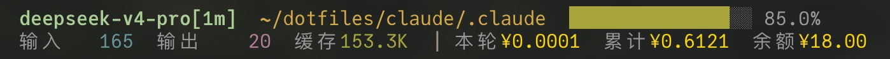

# Claude Code Statusline – DeepSeek Edition

A customizable two‑line status bar for [Claude Code](https://claude.ai/code) that shows model, workspace, git branch, context window progress, token usage, and **session‑based cost accumulation** (¥). Optimized for **DeepSeek models** – automatically fetches your balance and uses correct pricing.



## Features

- **Two‑line layout** – model + dir + branch + progress bar + effort (line 1), tokens + cost (line 2)
- **Block progress bar** – 16 blocks, colored by remaining percentage (green/yellow/red)
- **Token counters** – input, output, cache read (formatted as K/M)
- **Cost tracking** – per‑session JSON accumulator (`~/.claude/cache/statusline_cost.json`).  
  Each turn’s delta tokens are priced using DeepSeek rates (Flash, Pro, or fallback).
- **DeepSeek balance** – cached (60s) via `ANTHROPIC_AUTH_TOKEN` to `https://api.deepseek.com/user/balance`
- **Effort level** – low/medium/high with colored dot

## Installation

1. Save the script as `~/.claude/statusline.sh` and make it executable:
   ```bash
   chmod +x ~/.claude/statusline.sh
   ```
2. Add the following to your `~/.claude/settings.json`:
   ```json
   {
     "statusLine": {
       "type": "command",
       "command": "bash ~/.claude/statusline.sh"
     }
   }
   ```
3. The script automatically reads `$ANTHROPIC_AUTH_TOKEN` from the current Claude Code session's environment, so you typically don't need to manually set this environment variable – it's already available. (Balance fetching works out of the box if your DeepSeek API key is configured in Claude Code.)

## Usage

Claude Code will automatically run the script and display the two‑line status bar. No manual invocation needed.

## Pricing (¥ per million tokens)

| Model   | Input (cache miss) | Cache read (hit) | Output |
|---------|--------------------|------------------|--------|
| Flash   | ¥1.00              | ¥0.02            | ¥2.00  |
| Pro     | ¥3.00              | ¥0.025           | ¥6.00  |

Fallback = Flash pricing. Pricing last accessed on 2026/06/07.

## Files

- `~/.claude/cache/statusline_cost.json` – per‑session cumulative cost
- `~/.claude/cache/statusline_balance.cache` – cached balance (60s)

## License

MIT
